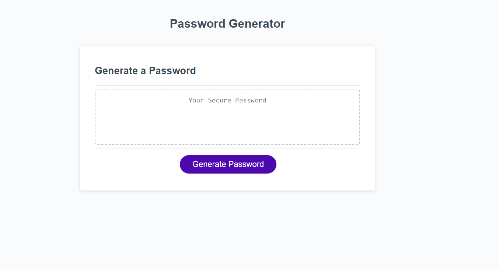
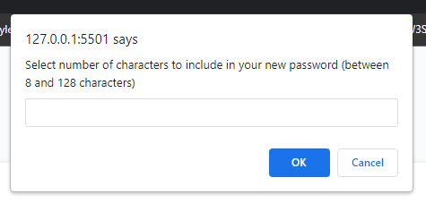
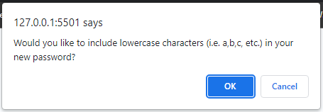
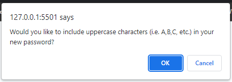
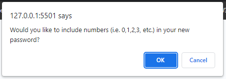
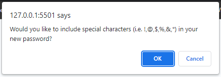
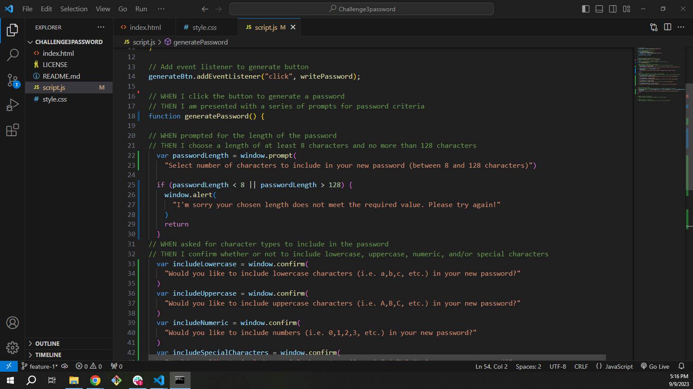
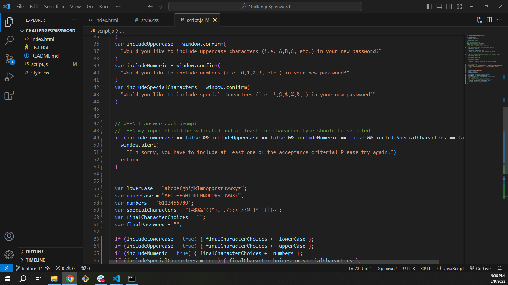
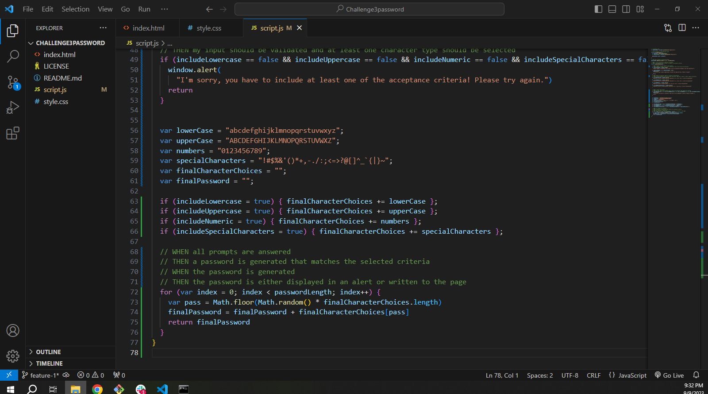
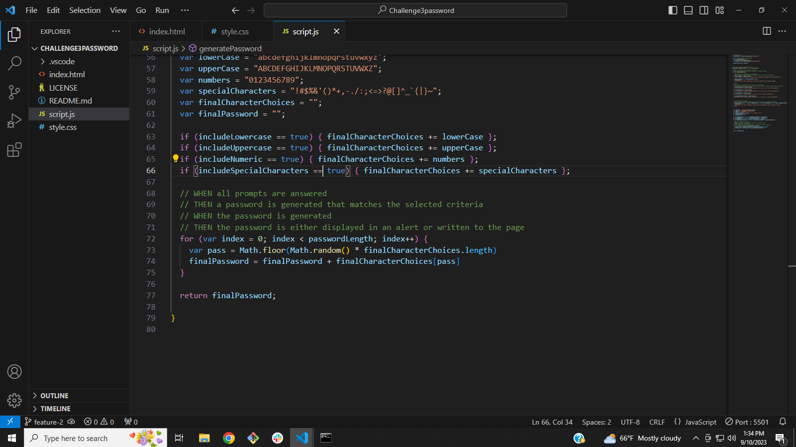

# Bootcamp Challenge 3 Random Password Generator

## Description

Random password generator in which you can select the length of your password, character type, and the computer generates a randomized password based on your selections.

## Usage

Click the "Generate Password" button. 

A prompt populates asking the number of characters you would like to include in your password. 

A confirmation box populates asking if you would like to include lowercase characters.

A confirmation box populates asking if you would like to include uppercase characters.

A confirmation box populates asking if you would like to include numbers.

A confirmation box populates asking if you would like to include special characters.

After your have slected all of your desired character types, then your new password will replace the "Your Secure Password" in the box on the screen!

## My Coding Process

At this point I was testing my site when I realized that it was only returning one character. So I started by switching the return value to a console log. In the console it returned each character on a different line and added the next letter to the full password on the following line, so that I would eventually see the final password on the final line. This led me to realize that my returned finalPassword was inside of the for loop! After moving the return finalPassword outside of the for loop and starting the testing process again I realized that matter whether I confirmed or canceled each selected character type, my passwords were including every single character type. Looking back at the if statements, I started commenting out each one to see if it would change anything.  When that didnt work I reviewed the w3schools documentation on comparison and realized that I was assigning the value of each variable instead of evaluating each one. 

## License

Copyright (c) 2023 Michael Arrasmith

Permission is hereby granted, free of charge, to any person obtaining a copy
of this software and associated documentation files (the "Software"), to deal
in the Software without restriction, including without limitation the rights
to use, copy, modify, merge, publish, distribute, sublicense, and/or sell
copies of the Software, and to permit persons to whom the Software is
furnished to do so, subject to the following conditions:

The above copyright notice and this permission notice shall be included in all
copies or substantial portions of the Software.

THE SOFTWARE IS PROVIDED "AS IS", WITHOUT WARRANTY OF ANY KIND, EXPRESS OR
IMPLIED, INCLUDING BUT NOT LIMITED TO THE WARRANTIES OF MERCHANTABILITY,
FITNESS FOR A PARTICULAR PURPOSE AND NONINFRINGEMENT. IN NO EVENT SHALL THE
AUTHORS OR COPYRIGHT HOLDERS BE LIABLE FOR ANY CLAIM, DAMAGES OR OTHER
LIABILITY, WHETHER IN AN ACTION OF CONTRACT, TORT OR OTHERWISE, ARISING FROM,
OUT OF OR IN CONNECTION WITH THE SOFTWARE OR THE USE OR OTHER DEALINGS IN THE
SOFTWARE.
